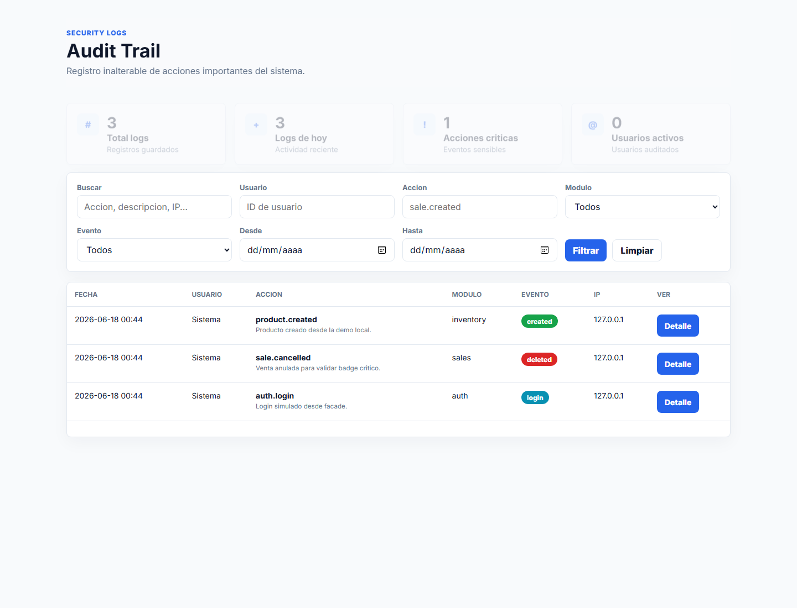
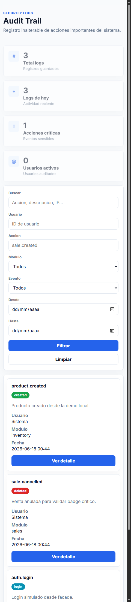
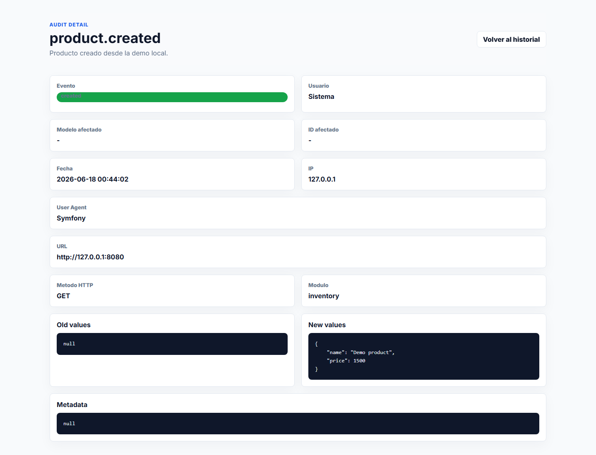

# Laravel Audit Trail Starter

[](https://www.php.net/)
[](https://laravel.com/)
[](LICENSE)

A lightweight and modern audit trail starter for Laravel applications.

Record important user actions, model changes, route activity, authentication events, and critical business operations in an immutable activity history.

Created and maintained by **Nathan de Barros**.

## Features

- Manual audit logging with a clean service API.
- Global `audit()` helper.
- `AuditTrail` facade.
- `Auditable` trait for Eloquent model events.
- Optional `audit.route` middleware for important routes.
- Publishable config, migration, and assets.
- Read-only `/audit-trail` panel protected by configurable middleware.
- Desktop table and mobile cards with Blade, CSS, and vanilla JavaScript.
- Immutable log model with no edit or delete panel routes.

## Installation

Install the package with Composer:

```bash
composer require nathandebarros/laravel-audit-trail-starter
```

Publish config, migration, and assets:

```bash
php artisan audit-trail:install
```

Or publish each group manually:

```bash
php artisan vendor:publish --tag=audit-trail-config
php artisan vendor:publish --tag=audit-trail-migrations
php artisan vendor:publish --tag=audit-trail-assets
```

Run the migration:

```bash
php artisan migrate
```

Visit the panel:

```txt
/audit-trail
```

By default, the panel uses `['web', 'auth']` middleware. You can change this in `config/audit-trail.php`.

## Configuration

```php
return [
    'enabled' => env('AUDIT_TRAIL_ENABLED', true),
    'route_prefix' => 'audit-trail',
    'middleware' => ['web', 'auth'],
    'table_name' => 'audit_logs',
    'track_ip' => true,
    'track_user_agent' => true,
    'track_url' => true,
    'track_model_events' => true,
    'ignored_fields' => ['password', 'remember_token', 'updated_at'],
];
```

## Basic Usage

```php
audit()->log(
    action: 'product.price_updated',
    description: 'The product price was updated.',
    auditable: $product,
    oldValues: ['price' => 1200],
    newValues: ['price' => 1500],
    module: 'inventory',
);
```

## Facade Usage

```php
use NathanDeBarros\AuditTrail\Facades\AuditTrail;

AuditTrail::log('sale.created', $sale);
```

## Model Trait

```php
use Illuminate\Database\Eloquent\Model;
use NathanDeBarros\AuditTrail\Traits\Auditable;

class Product extends Model
{
    use Auditable;
}
```

The trait records:

- `created`
- `updated`
- `deleted`
- `restored`

Sensitive fields from `ignored_fields` are removed before logs are written.

## Route Middleware

```php
Route::post('/sales', [SaleController::class, 'store'])
    ->middleware('audit.route:sale.created,sales');
```

The middleware logs the route after a successful response.

## Audit Panel

The read-only panel includes:

- Summary cards.
- Text, user, action, module, event, and date filters.
- Desktop table.
- Mobile card layout.
- Detail page with old values, new values, and metadata JSON blocks.

There are intentionally no edit or delete routes.

## Screenshots

### Desktop



### Mobile



### Detail



## Local Demo

This repository may contain a local `demo-app/` while developing or testing the package. It is ignored by Git and is not required by package users.

To test the package in a Laravel app, install it with Composer, publish the assets, run the migration, and visit `/audit-trail`.

## Testing

```bash
composer test
```

## Roadmap

- Export CSV.
- Export PDF.
- Optional pruning with backup.
- Dashboard charts.
- Multi-tenant support.
- Spatie Permissions integration.
- Notifications for critical actions.
- Webhook delivery for external logs.

## Contributing

Pull requests are welcome. Keep the package small, readable, and focused on reliable audit history.

## Author

**Nathan de Barros**

## License

The MIT License. See [LICENSE](LICENSE).
